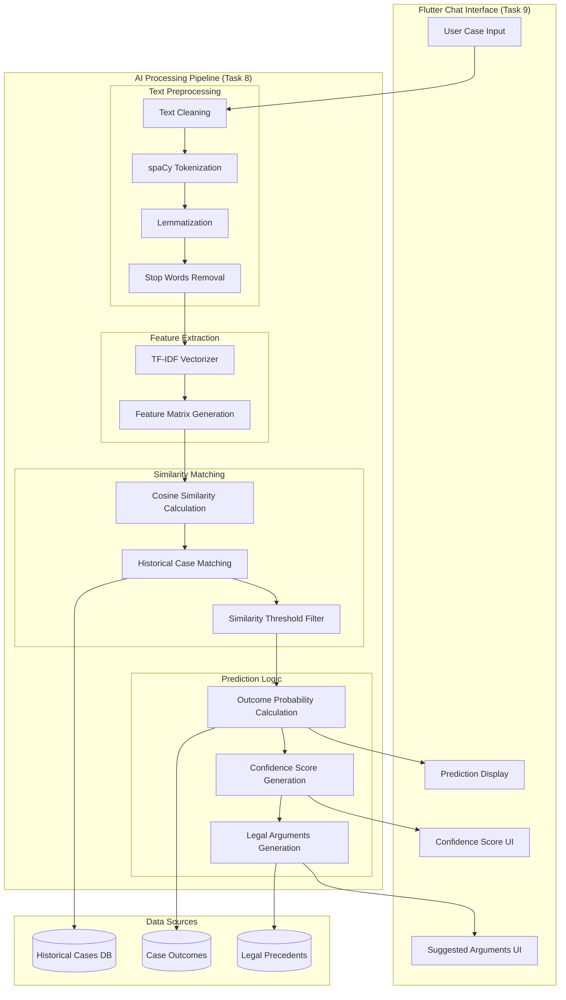
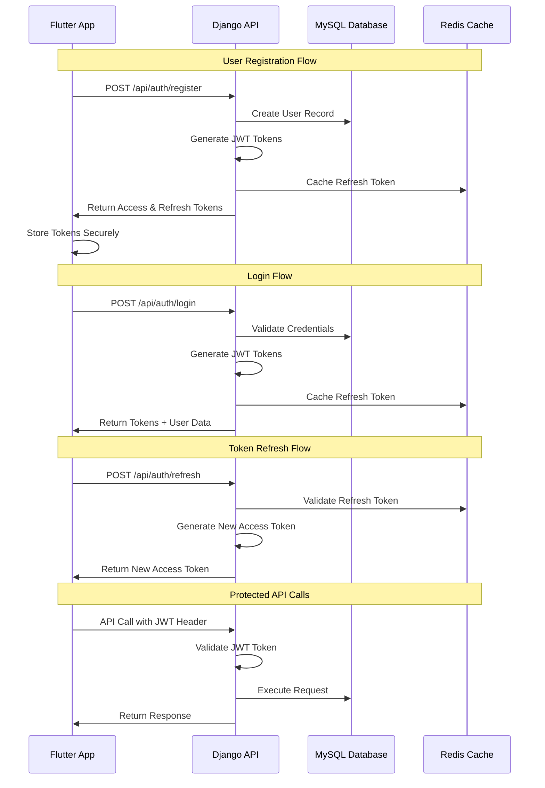
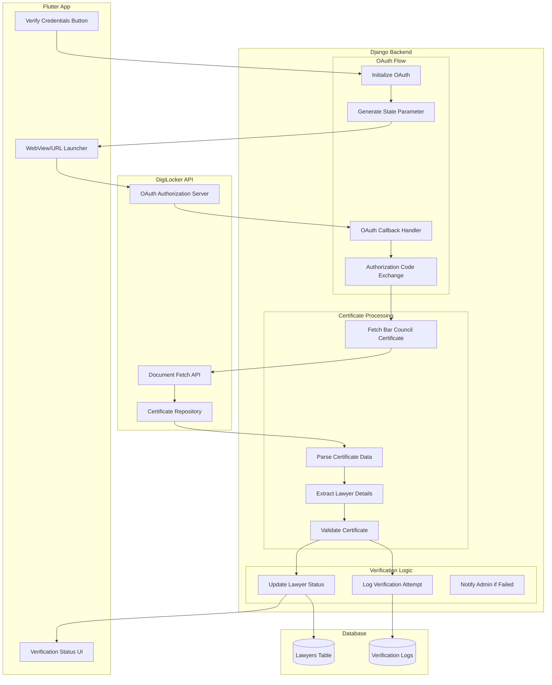
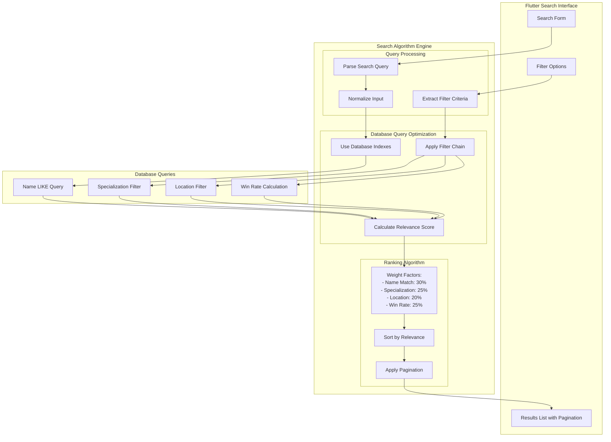
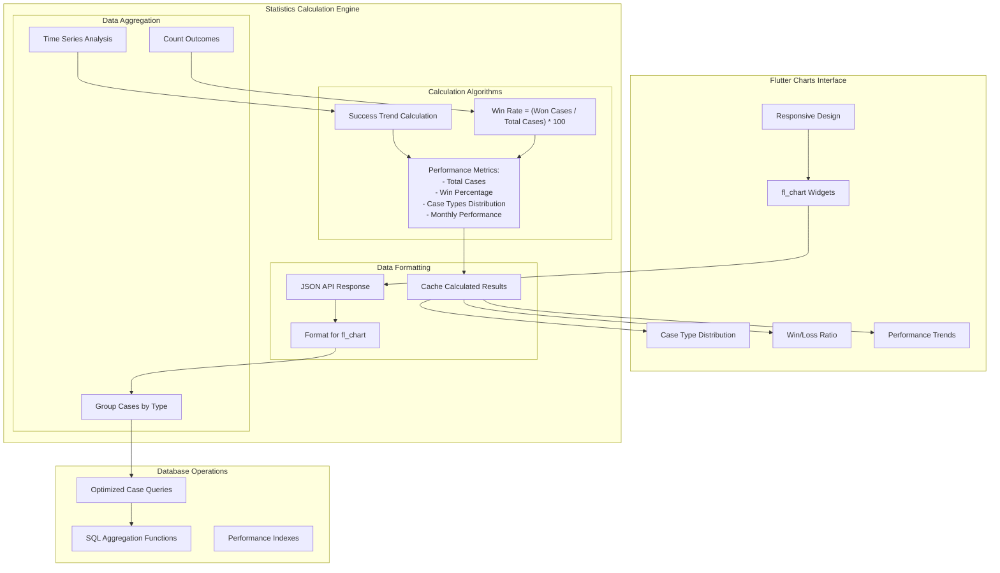
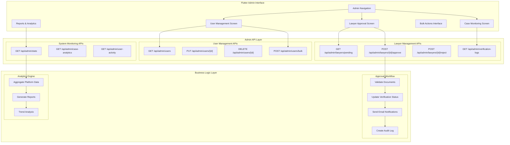
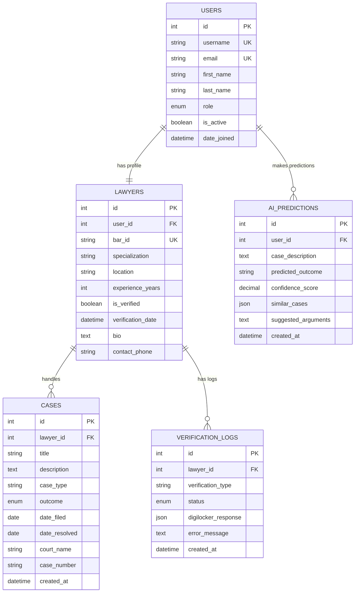
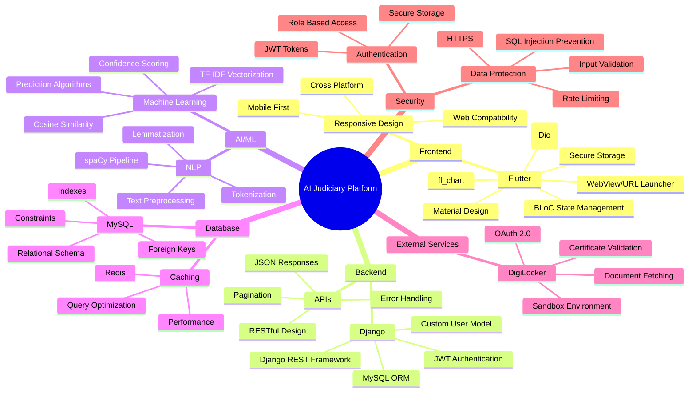

# Architecture Diagrams

## 1. Overall System Architecture with Task Mapping

```mermaid
graph TB
    subgraph "Flutter Frontend (Tasks 2, 3, 5, 6, 7, 9, 11, 12)"
        UI[Flutter UI Layer]
        STATE[State Management - BLoC]
        AUTH_UI[Auth Screens]
        LAWYER_UI[Lawyer Profile Screens]
        SEARCH_UI[Search Interface]
        CHAT_UI[AI Chatbot Interface]
        ADMIN_UI[Admin Dashboard]
        CHARTS[fl_chart Visualizations]
    end
    
    subgraph "Django REST API Backend (Tasks 1, 2, 4, 8, 10)"
        subgraph "Authentication (Task 2)"
            JWT[JWT Token Management]
            USER_API[User Registration/Login APIs]
        end
        
        subgraph "Lawyer Management (Tasks 3, 4)"
            LAWYER_API[Lawyer Profile APIs]
            DIGILOCKER[DigiLocker OAuth Integration]
            VERIFICATION[Verification Workflow]
        end
        
        subgraph "Case Management (Task 5)"
            CASE_API[Case CRUD APIs]
            STATS_API[Statistics Calculation]
        end
        
        subgraph "AI Prediction Engine (Tasks 8, 9)"
            NLP_PIPELINE[spaCy NLP Pipeline]
            TFIDF[TF-IDF Vectorization]
            SIMILARITY[Cosine Similarity]
            PREDICTION[Case Outcome Prediction]
        end
        
        subgraph "Admin Panel (Task 11)"
            ADMIN_API[Admin Management APIs]
            BULK_OPS[Bulk Operations]
        end
    end
    
    subgraph "External Services"
        DIGILOCKER_API[DigiLocker Sandbox API]
    end
    
    subgraph "Data Layer (Task 1)"
        MYSQL[(MySQL Database)]
        REDIS[(Redis Cache)]
    end
    
    UI --> STATE
    STATE --> JWT
    AUTH_UI --> USER_API
    LAWYER_UI --> LAWYER_API
    SEARCH_UI --> LAWYER_API
    CHAT_UI --> NLP_PIPELINE
    ADMIN_UI --> ADMIN_API
    CHARTS --> STATS_API
    
    DIGILOCKER --> DIGILOCKER_API
    LAWYER_API --> MYSQL
    CASE_API --> MYSQL
    NLP_PIPELINE --> MYSQL
    ADMIN_API --> MYSQL
    STATS_API --> REDIS
```

## 2. AI/NLP Pipeline Architecture (Tasks 8, 9)

## 3. Authentication Flow Architecture (Task 2)

## 4. DigiLocker Integration Architecture (Task 4)

## 5. Lawyer Search Algorithm Architecture (Task 6)

## 6. Case Statistics and Visualization Architecture (Task 7)

## 7. Admin Dashboard Architecture (Task 11)

## 8. Database Schema and Relationships (Task 1)

## 9. Task Dependencies and Implementation Flow

```mermaid
gantt
    title Implementation Timeline and Dependencies
    dateFormat  X
    axisFormat %d
    
    section Foundation
    Task 1 - Django & Flutter Setup    :t1, 0, 3
    Task 2 - JWT Authentication        :t2, after t1, 4
    
    section Core Features
    Task 3 - Lawyer Profiles          :t3, after t2, 3
    Task 4 - DigiLocker Integration   :t4, after t3, 5
    Task 5 - Case Management          :t5, after t3, 3
    Task 6 - Lawyer Search            :t6, after t5, 3
    Task 7 - Data Visualization       :t7, after t5, 3
    
    section AI Components
    Task 8 - AI/NLP Foundation        :t8, after t1, 4
    Task 9 - AI Chatbot               :t9, after t8, 4
    
    section Integration
    Task 10 - Complete REST APIs      :t10, after t6, 3
    Task 11 - Admin Dashboard         :t11, after t10, 4
    Task 12 - Flutter UI/UX           :t12, after t7, 4
    
    section Quality & Deployment
    Task 13 - Form Validation         :t13, after t12, 2
    Task 14 - Security Measures       :t14, after t13, 3
    Task 15 - Performance Optimization :t15, after t14, 2
    Task 16 - Testing Suite           :t16, after t15, 4
    Task 17 - Documentation           :t17, after t16, 2
    Task 18 - Final Integration       :t18, after t17, 3
```

## 10. Technology Stack Integration Map

These architecture diagrams provide a comprehensive view of how each task integrates with the overall system, the specific algorithms used, and the technology stack implementation. Each diagram maps directly to the implementation tasks and shows the technical details needed for development.