# Architecture Diagrams

## 1. Overall System Architecture with Task Mapping

```mermaid
graph TB
    subgraph "Flutter Frontend (Tasks 2, 3, 5, 6, 7, 9, 11, 12)"
        UI[Flutter UI Layer]
        STATE[State Management - BLoC]
        AUTH_UI[Auth Screens]
        LAWYER_UI[Lawyer Profile Screens]
        SEARCH_UI[Search Interface]
        CHAT_UI[AI Chatbot Interface]
        ADMIN_UI[Admin Dashboard]
        CHARTS[fl_chart Visualizations]
    end
    
    subgraph "Django REST API Backend (Tasks 1, 2, 4, 8, 10)"
        subgraph "Authentication (Task 2)"
            JWT[JWT Token Management]
            USER_API[User Registration/Login APIs]
        end
        
        subgraph "Lawyer Management (Tasks 3, 4)"
            LAWYER_API[Lawyer Profile APIs]
            OCR_VERIFICATION[OCR Verification System]
            MOCK_VERIFICATION[Mock Verification Demo]
            VERIFICATION[Verification Workflow]
        end
        
        subgraph "Case Management (Task 5)"
            CASE_API[Case CRUD APIs]
            STATS_API[Statistics Calculation]
        end
        
        subgraph "AI Prediction Engine (Tasks 8, 9)"
            NLP_PIPELINE[spaCy NLP Pipeline]
            TFIDF[TF-IDF Vectorization]
            SIMILARITY[Cosine Similarity]
            PREDICTION[Case Outcome Prediction]
        end
        
        subgraph "Admin Panel (Task 11)"
            ADMIN_API[Admin Management APIs]
            BULK_OPS[Bulk Operations]
        end
    end
    
    subgraph "External Services"
        TESSERACT_OCR[Tesseract OCR Engine]
        EMAIL_SERVICE[Email Notification Service]
        FILE_STORAGE[File Storage Service]
    end
    
    subgraph "Data Layer (Task 1)"
        MYSQL[(MySQL Database)]
        REDIS[(Redis Cache)]
    end
    
    UI --> STATE
    STATE --> JWT
    AUTH_UI --> USER_API
    LAWYER_UI --> LAWYER_API
    SEARCH_UI --> LAWYER_API
    CHAT_UI --> NLP_PIPELINE
    ADMIN_UI --> ADMIN_API
    CHARTS --> STATS_API
    
    OCR_VERIFICATION --> TESSERACT_OCR
    VERIFICATION --> EMAIL_SERVICE
    LAWYER_API --> MYSQL
    CASE_API --> MYSQL
    NLP_PIPELINE --> MYSQL
    ADMIN_API --> MYSQL
    STATS_API --> REDIS
```

## 2. AI/NLP Pipeline Architecture (Tasks 8, 9)

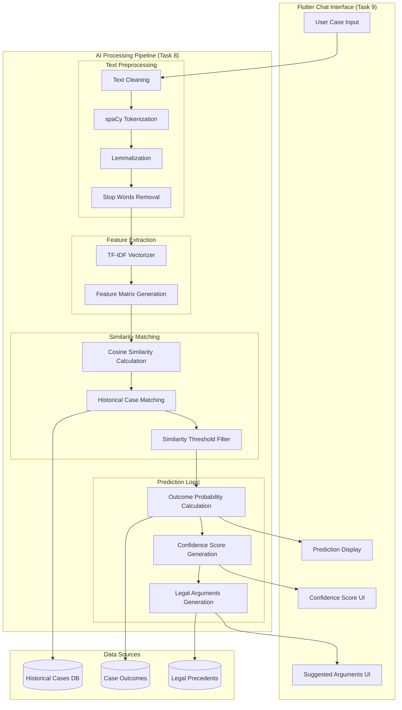

## 3. Authentication Flow Architecture (Task 2)

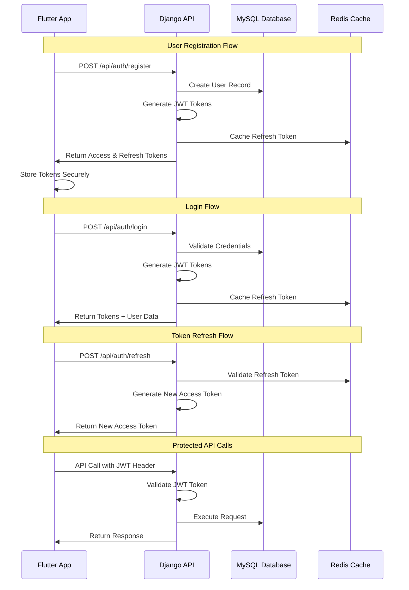

## 4. Multi-Method Verification System Architecture (Task 4)

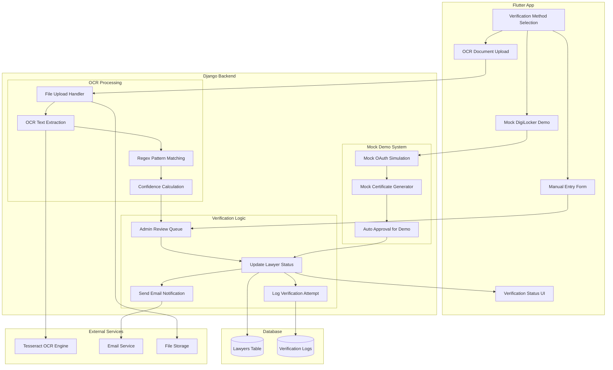

## 5. Lawyer Search Algorithm Architecture (Task 6)

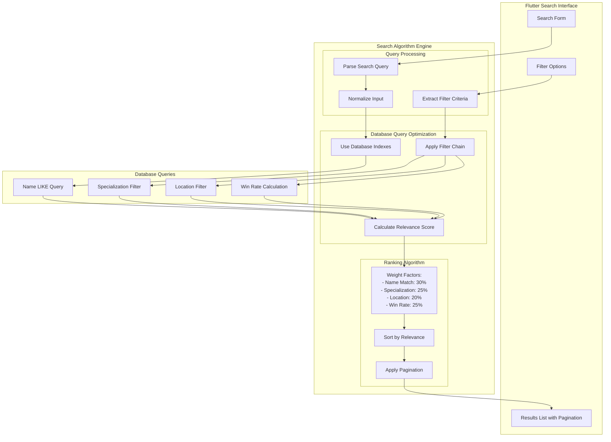

## 6. Case Statistics and Visualization Architecture (Task 7)

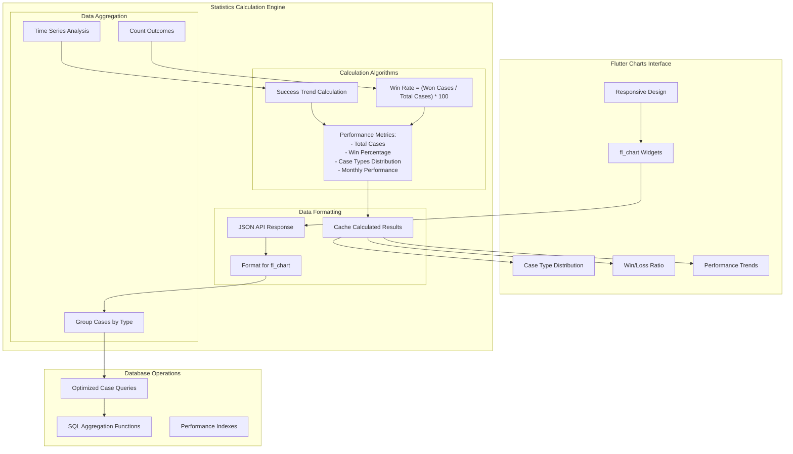

## 7. Admin Dashboard Architecture (Task 11)

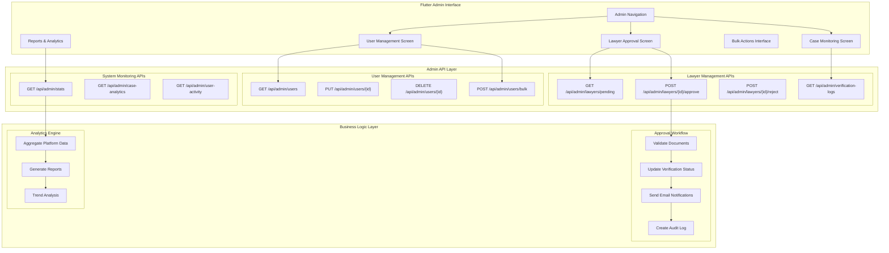

## 8. Database Schema and Relationships (Task 1)

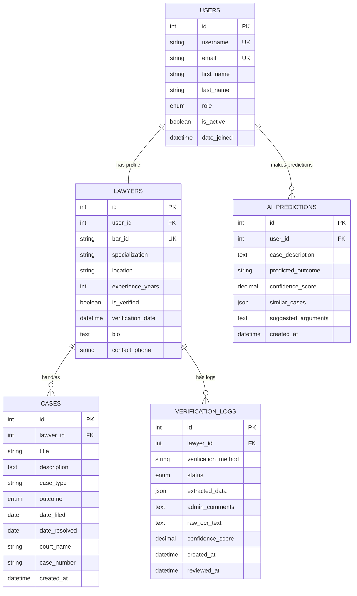

## 9. Task Dependencies and Implementation Flow

## 10. Technology Stack Integration Map

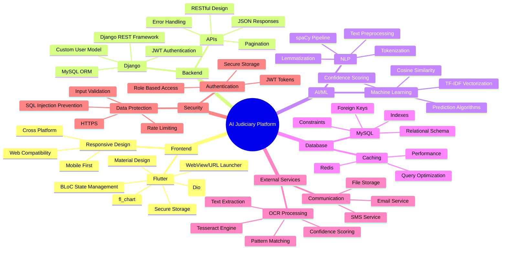

## 11. Simplified System Architecture Flow

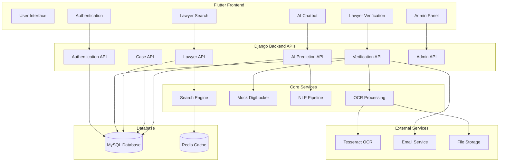

## 12. Practical Verification Methods Data Flow

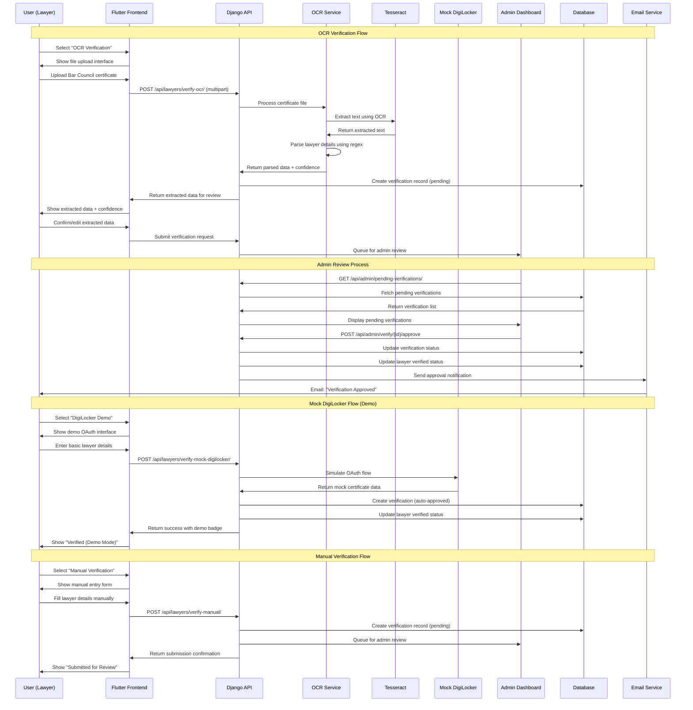

## 13. AI Prediction System Architecture

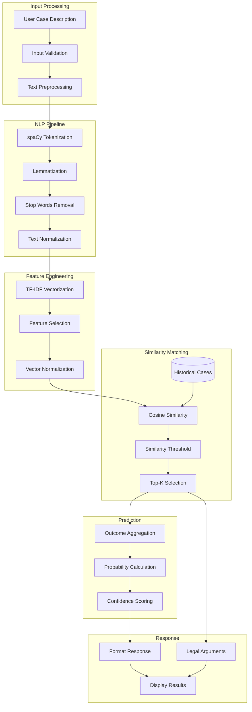

## 14. Security Architecture Overview

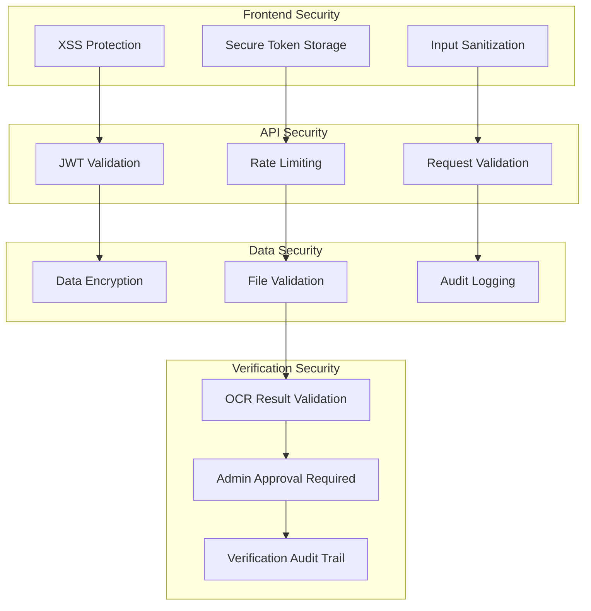

These comprehensive architecture diagrams provide a complete view of the AI-Enhanced Judiciary Platform with practical verification methods that address real-world deployment constraints while maintaining technical depth and academic value.