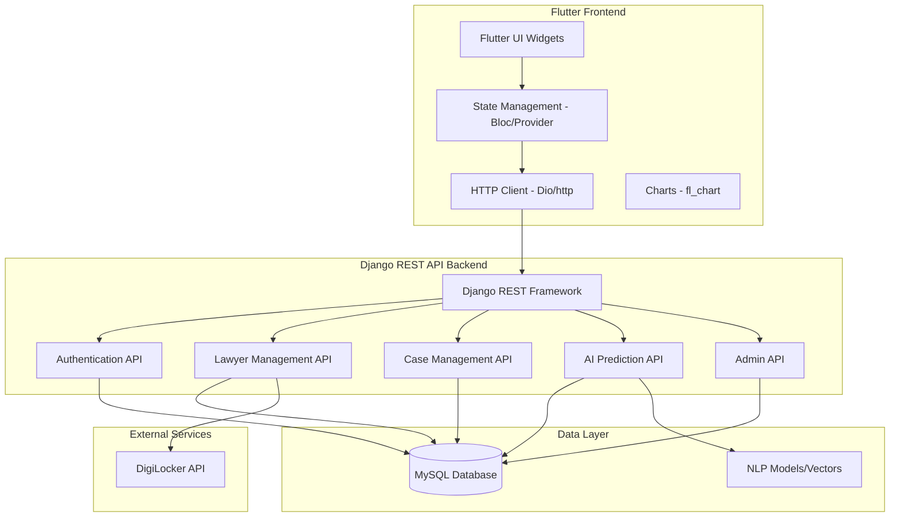

# Design Document

## Overview

The AI-Enhanced Judiciary Platform is designed as a modern full-stack application with a Flutter mobile/web frontend and Django REST API backend. The system implements a clean separation between the Flutter client and Django backend, with all communication happening through RESTful APIs. The Django backend focuses purely on business logic, data management, and AI processing, while Flutter handles all UI rendering, state management, and user interactions.

The platform integrates with DigiLocker's sandbox API for lawyer verification and implements a custom NLP pipeline using spaCy and scikit-learn for case prediction. The architecture supports horizontal scaling and maintains clear separation between presentation, business logic, and data layers.

## Architecture

### System Architecture



### Application Structure

The application will be organized into two main components:

**Django Backend Apps:**
- **accounts**: User authentication and JWT token management
- **lawyers**: Lawyer profiles, verification, and search APIs
- **cases**: Case management and history APIs
- **ai_prediction**: NLP pipeline and case prediction APIs
- **admin_panel**: Administrative APIs and management tools

**Flutter Frontend Structure:**
- **lib/models**: Data models and serialization
- **lib/services**: API service classes and HTTP clients
- **lib/screens**: UI screens and pages
- **lib/widgets**: Reusable UI components
- **lib/bloc**: State management using BLoC pattern
- **lib/utils**: Utilities and helpers

## Components and Interfaces

### Authentication System

**Components:**
- Custom User model extending Django's AbstractUser
- Role-based permissions using Django groups
- Session management with secure cookies
- Password reset functionality

**Interfaces:**
- JWT token-based authentication APIs
- Login/Register endpoints with validation
- Token refresh and logout endpoints
- Role-based API access control

### DigiLocker Integration

**Components:**
- OAuth 2.0 client implementation
- Certificate parsing and validation
- Verification status tracking
- Error handling and retry logic

**Interfaces:**
- DigiLocker authorization API endpoints
- OAuth callback handling APIs
- Certificate validation APIs
- Verification status APIs for Flutter consumption

### Lawyer Management System

**Components:**
- Lawyer profile CRUD operations
- Case history management
- Performance analytics calculation
- Search and filtering engine

**Interfaces:**
- Profile CRUD APIs
- Case management APIs
- Statistics and analytics APIs
- Search and filtering APIs with pagination

### AI Prediction Engine

**Components:**
- spaCy NLP pipeline for text processing
- TF-IDF vectorization using scikit-learn
- Cosine similarity calculation
- Prediction confidence scoring
- Case matching algorithm

**Interfaces:**
- Case prediction APIs
- Real-time prediction endpoints
- Confidence scoring APIs
- Suggested arguments APIs

### Administrative Dashboard

**Components:**
- User management interface
- Lawyer verification workflow
- System monitoring tools
- Bulk operations support

**Interfaces:**
- Admin management APIs
- Approval/rejection workflow APIs
- System statistics APIs
- Data export APIs

## Data Models

### Database Schema

```sql
-- Users table (extends Django's auth_user)
CREATE TABLE accounts_customuser (
    id INT PRIMARY KEY AUTO_INCREMENT,
    username VARCHAR(150) UNIQUE NOT NULL,
    email VARCHAR(254) UNIQUE NOT NULL,
    first_name VARCHAR(150),
    last_name VARCHAR(150),
    role ENUM('user', 'lawyer', 'admin') DEFAULT 'user',
    is_active BOOLEAN DEFAULT TRUE,
    date_joined DATETIME DEFAULT CURRENT_TIMESTAMP
);

-- Lawyers table
CREATE TABLE lawyers_lawyer (
    id INT PRIMARY KEY AUTO_INCREMENT,
    user_id INT UNIQUE,
    bar_id VARCHAR(50) UNIQUE,
    specialization VARCHAR(100),
    location VARCHAR(100),
    experience_years INT,
    is_verified BOOLEAN DEFAULT FALSE,
    verification_date DATETIME,
    bio TEXT,
    contact_phone VARCHAR(15),
    FOREIGN KEY (user_id) REFERENCES accounts_customuser(id)
);

-- Cases table
CREATE TABLE cases_case (
    id INT PRIMARY KEY AUTO_INCREMENT,
    lawyer_id INT,
    title VARCHAR(200) NOT NULL,
    description TEXT,
    case_type VARCHAR(50),
    outcome ENUM('won', 'lost', 'settled', 'ongoing'),
    date_filed DATE,
    date_resolved DATE,
    court_name VARCHAR(100),
    case_number VARCHAR(50),
    created_at DATETIME DEFAULT CURRENT_TIMESTAMP,
    FOREIGN KEY (lawyer_id) REFERENCES lawyers_lawyer(id)
);

-- Verification Logs table
CREATE TABLE lawyers_verificationlog (
    id INT PRIMARY KEY AUTO_INCREMENT,
    lawyer_id INT,
    verification_type VARCHAR(50),
    status ENUM('pending', 'success', 'failed'),
    digilocker_response JSON,
    error_message TEXT,
    created_at DATETIME DEFAULT CURRENT_TIMESTAMP,
    FOREIGN KEY (lawyer_id) REFERENCES lawyers_lawyer(id)
);

-- AI Predictions table
CREATE TABLE ai_prediction_prediction (
    id INT PRIMARY KEY AUTO_INCREMENT,
    user_id INT,
    case_description TEXT,
    predicted_outcome VARCHAR(50),
    confidence_score DECIMAL(5,4),
    similar_cases JSON,
    suggested_arguments TEXT,
    created_at DATETIME DEFAULT CURRENT_TIMESTAMP,
    FOREIGN KEY (user_id) REFERENCES accounts_customuser(id)
);
```

### Django Model Relationships

- **User** (1:1) **Lawyer**: Each lawyer has one user account
- **Lawyer** (1:N) **Case**: Each lawyer can have multiple cases
- **Lawyer** (1:N) **VerificationLog**: Track multiple verification attempts
- **User** (1:N) **Prediction**: Users can make multiple predictions

## Error Handling

### Application-Level Error Handling

**Authentication Errors:**
- Invalid credentials: Display user-friendly error message
- Session timeout: Redirect to login with notification
- Permission denied: Show 403 page with explanation

**DigiLocker Integration Errors:**
- API timeout: Retry mechanism with exponential backoff
- Invalid certificate: Log error and notify admin
- OAuth failure: Clear session and restart flow

**Database Errors:**
- Connection failure: Display maintenance page
- Constraint violations: Show validation errors
- Transaction rollback: Ensure data consistency

**AI Prediction Errors:**
- Model loading failure: Fallback to basic matching
- Insufficient data: Request more case details
- Processing timeout: Queue for background processing

### Error Logging and Monitoring

- Django logging configuration for different environments
- Error tracking with detailed stack traces
- Performance monitoring for database queries
- API response time monitoring

## Testing Strategy

### Unit Testing

**Model Tests:**
- User creation and role assignment
- Lawyer profile validation
- Case outcome calculations
- Prediction accuracy metrics

**View Tests:**
- Authentication flow testing
- Form validation testing
- Permission-based access testing
- API endpoint response testing

**Service Tests:**
- DigiLocker integration testing
- NLP pipeline testing
- Search algorithm testing
- Statistics calculation testing

### Integration Testing

**End-to-End Workflows:**
- Complete user registration and verification
- Lawyer profile creation and case addition
- AI prediction generation and display
- Admin approval workflows

**API Testing:**
- REST endpoint functionality
- Authentication token validation
- Data serialization/deserialization
- Error response handling

### Performance Testing

**Load Testing:**
- Concurrent user authentication
- Database query optimization
- AI prediction response times
- Search performance with large datasets

**Security Testing:**
- SQL injection prevention
- XSS protection validation
- CSRF token verification
- OAuth flow security

### Test Data Management

- Factory classes for model creation
- Mock DigiLocker API responses
- Sample case data for AI training
- Automated test database setup/teardown

## Security Considerations

### Authentication Security

- Password hashing using Django's PBKDF2
- Session security with secure cookies
- CSRF protection on all forms
- Rate limiting on login attempts

### API Security

- Token-based authentication for API endpoints
- Input validation and sanitization
- SQL injection prevention using ORM
- XSS protection with template escaping

### Data Protection

- Sensitive data encryption at rest
- Secure transmission using HTTPS
- Personal data anonymization options
- GDPR compliance considerations

### DigiLocker Integration Security

- OAuth 2.0 state parameter validation
- Secure token storage and refresh
- Certificate validation and verification
- Audit logging for all verification attempts

## Performance Optimization

### Database Optimization

- Proper indexing on frequently queried fields
- Query optimization using select_related and prefetch_related
- Database connection pooling
- Read replica configuration for scaling

### Caching Strategy

- Redis caching for frequently accessed data
- Template fragment caching
- API response caching with appropriate TTL
- Static file caching with CDN

### AI Model Optimization

- Pre-computed TF-IDF vectors for existing cases
- Efficient similarity calculation algorithms
- Background processing for heavy computations
- Model caching to avoid repeated loading

### Frontend Optimization

- Minified CSS and JavaScript
- Image optimization and lazy loading
- Progressive enhancement for mobile devices
- Efficient Chart.js configuration for large datasets